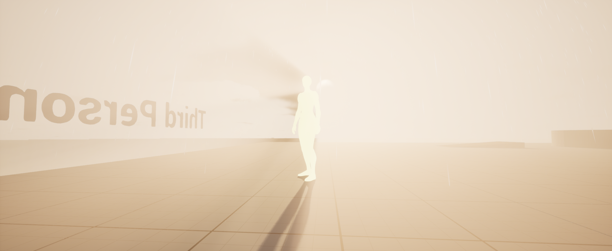
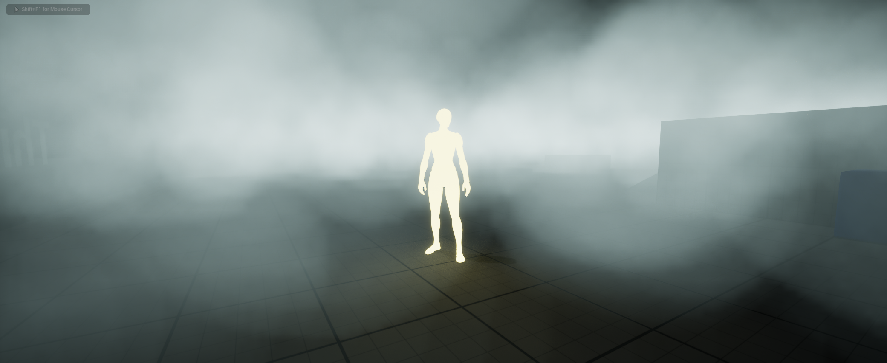
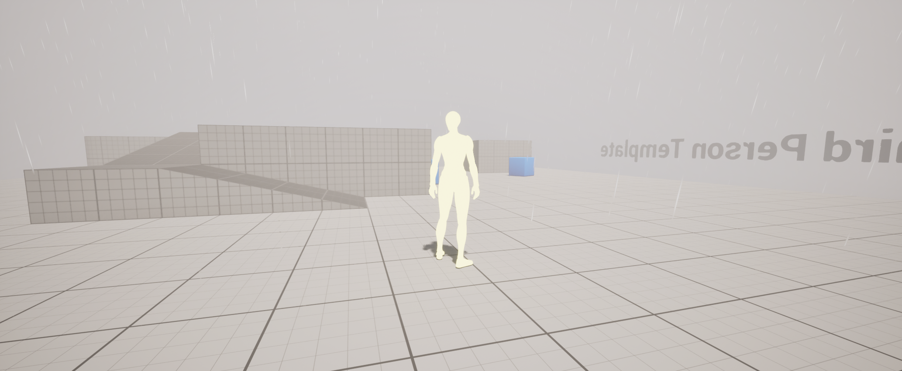
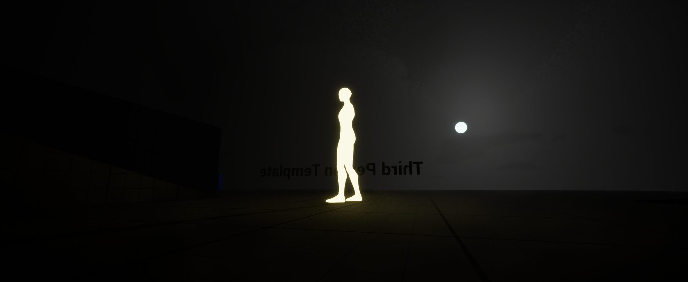
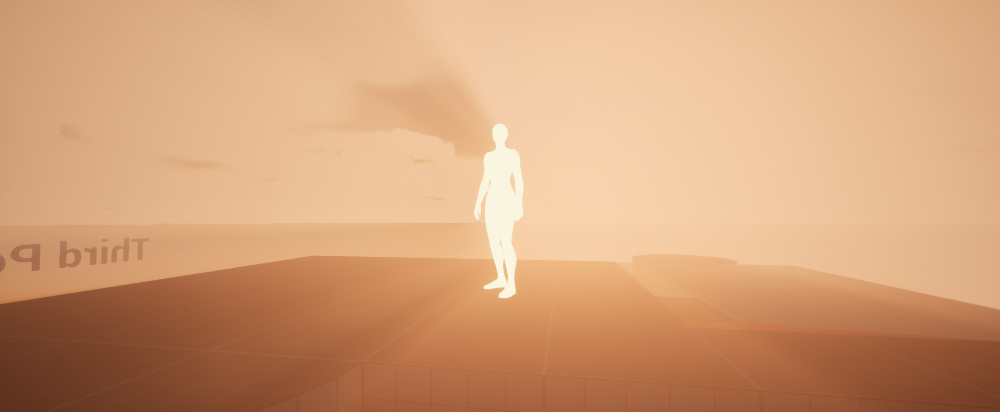
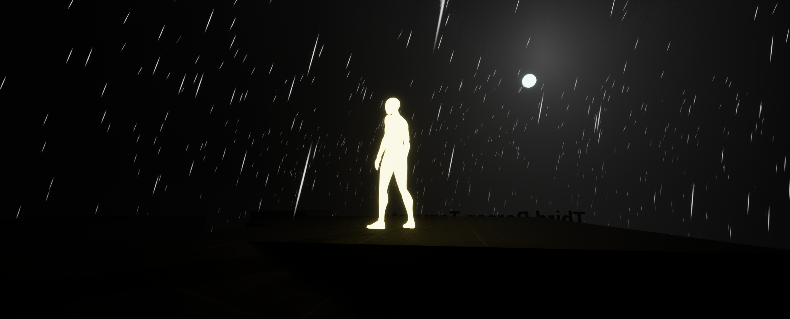

# UE5 Dynamic Weather System

## Overview
This Unreal Engine 5 Dynamic Weather System provides an easy-to-implement solution for dynamic and realistic weather effects in your UE5 projects. The system allows for the simulation of various weather conditions, including rain, snow, storms, fog, and more, with seamless transitions between weather states. It enhances the visual atmosphere of any project, making it more immersive and visually captivating.

## Key Features
- **Dynamic Weather Transitions**: Switch between different weather conditions smoothly without any interruptions.
- **Customizable Weather Patterns**: Modify weather settings like rain intensity, cloud coverage, wind strength, and more through easy-to-use parameters.
- **Day/Night Cycle Support**: The system fully integrates with Unreal Engine's time-of-day system, allowing weather changes based on the time of day.
- **Realistic Visual Effects**: Includes rain droplets, snowflakes, lightning, and fog to create a truly immersive weather environment.
- **Performance Optimized**: Designed with performance in mind, ensuring minimal impact on FPS while delivering high-quality visuals.
- **Modular & Extendable**: Easily extend the system with new weather effects or integrate it into existing projects.

## Usage
- Use the **Weather Controller Blueprint** to manage and trigger different weather states.
- Modify parameters such as precipitation intensity, cloud speed, wind direction, and temperature to fit the desired environmental conditions.
- Combine with Unreal Engine’s time-of-day system to create realistic day/night cycles with corresponding weather changes.

## Future Plans
- Add more weather types (e.g., thunderstorms, sandstorms).
- Improve weather transition smoothing and control.
- Implement more advanced skybox and lighting effects.
